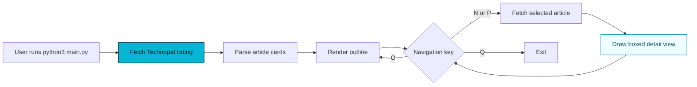

<div align="center">


</div>

## Terminal-First News Reading

Technopat Grabber CLI gives you a fast way to scan current Technopat news without opening a browser tab. It fetches the latest article list, formats each story in a clean terminal box, and lets you move through details with single-key navigation.


## What It Does Well

- Pulls headline cards from `https://www.technopat.net/haber/`
- Fetches article body text on demand
- Wraps content to the current terminal width
- Renders boxed views with `colorama`
- Supports next, previous, outline, and quit actions

> This project reads public pages from Technopat. Be respectful with repeated runs and avoid automated polling.

## Quick Start

```bash
python3 -m venv .venv
source .venv/bin/activate
pip install requests beautifulsoup4 colorama
python3 main.py
```

Keyboard controls:

| Key | Action |
| --- | --- |
| <kbd>N</kbd> | Open the next article |
| <kbd>P</kbd> | Return to the previous article |
| <kbd>O</kbd> | Show the headline outline |
| <kbd>Q</kbd> | Exit the reader |

## News Pipeline



<details>
<summary>Advanced configuration notes</summary>

The fetch behavior is intentionally simple:

- `BASE_URL` points to the Technopat news listing.
- `REQUEST_TIMEOUT` protects the CLI from hanging on slow network responses.
- `HEADERS` sets a browser-like user agent for consistent page responses.

If Technopat changes its markup, update the selectors in `fetch_news_list()` and `fetch_news_content()`.

</details>

## Screenshots

### Outline View


### Article Detail View


## Project Layout

```text
TechnopatGrabber/
├── main.py
├── screenshots/
│   ├── SS1.png
│   └── SS2.png
└── README.md
```

## License

Released under the MIT License.
