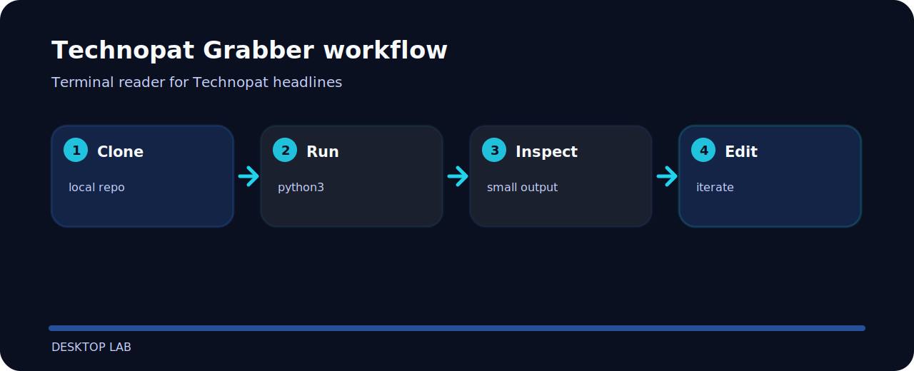

# Technopat Grabber


Terminal reader for Technopat headlines.

## Project route



## Run it locally

```bash
git clone https://github.com/mertefekurt/TechnopatGrabber.git
cd TechnopatGrabber
python3 main.py
```

## Notes from the build

- Designed as a focused desktop lab repo.
- Keeps setup short.
- Prioritizes readable output over infrastructure.

## Open these first

```text
screenshots/  project file
.gitignore    project file
main.py       application entry
```
