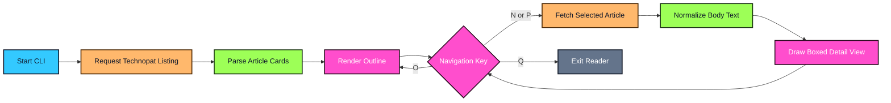
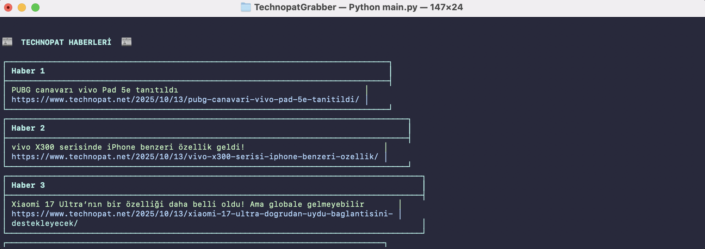
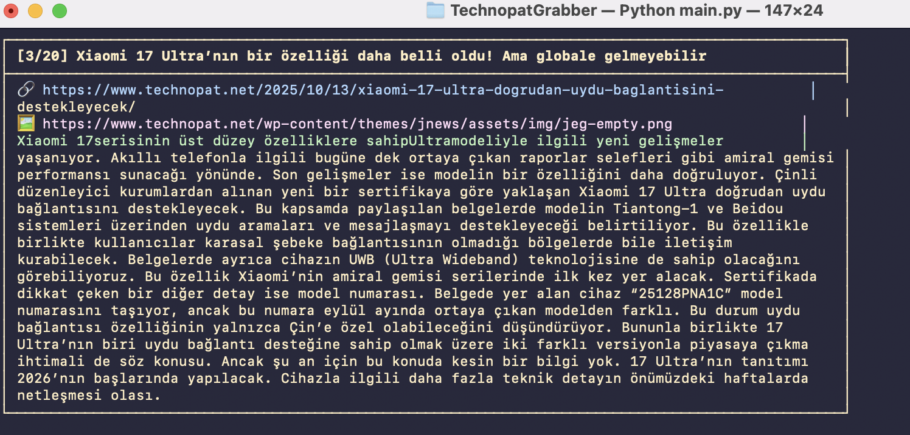

<div align="center">


</div>


TechnopatGrabber is a focused Python CLI that fetches Technopat's public news feed, extracts article cards, and renders readable terminal views. It keeps the workflow fast: scan the outline, jump between stories, inspect article content, and exit without opening a single tab.

<table>
  <tr>
    <td width="50%" valign="top">


- 📰 Pulls current Technopat news cards from the public listing page
- 🧭 Supports next, previous, outline, and quit navigation
- 📦 Draws terminal-friendly boxed article views with Colorama
- 🧼 Wraps long content to the active terminal width
- 🕸️ Parses article body text on demand with BeautifulSoup
- ⏱️ Uses timeouts and browser-like headers for reliable fetches

    </td>
    <td width="50%" valign="top">


    </td>
  </tr>
</table>





```bash
git clone https://github.com/mertefekurt/TechnopatGrabber.git
cd TechnopatGrabber
python3 -m venv .venv
source .venv/bin/activate
pip install requests beautifulsoup4 colorama
python3 main.py
```

<details>
<summary>🛠️ View CLI Reference / Advanced Config</summary>

| Key | Action |
| --- | --- |
| `N` | Open the next article |
| `P` | Return to the previous article |
| `O` | Show the headline outline |
| `Q` | Exit the reader |

| Constant | Purpose |
| --- | --- |
| `BASE_URL` | Public Technopat news listing URL |
| `REQUEST_TIMEOUT` | Maximum wait time for network requests |
| `HEADERS` | Browser-like request headers for consistent responses |

If Technopat changes its page markup, update the selectors inside `fetch_news_list()` and `fetch_news_content()`.

</details>


| Outline View | Detail View |
| --- | --- |
|  |  |


```text
TechnopatGrabber/
├── main.py
├── screenshots/
│   ├── SS1.png
│   └── SS2.png
└── assets/
    └── code-snapshot.png
```
