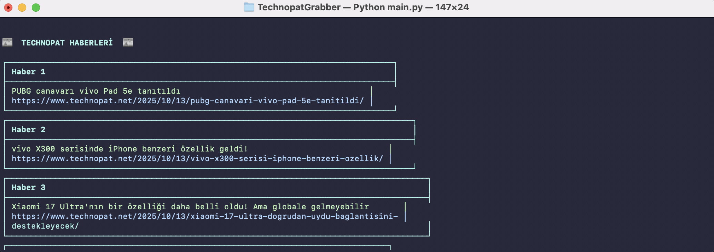
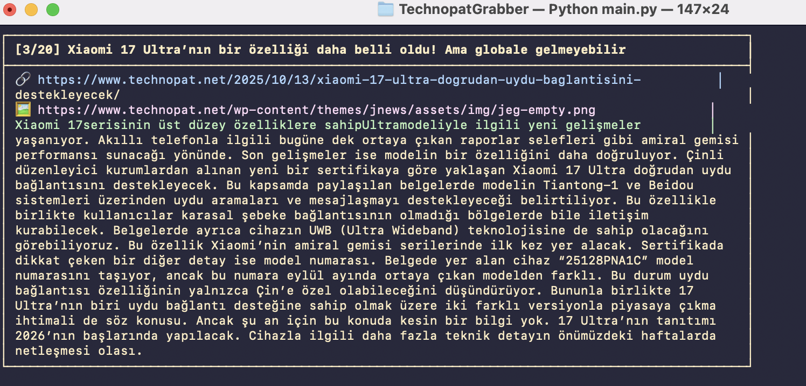

#  Technopat Grabber CLI v4

 Technopat Grabber, Technopat.net üzerindeki güncel teknoloji haberlerini terminal üzerinden hızlı ve okunabilir bir şekilde sunan bir Python komut satırı uygulamasıdır.  Kullanım tamamen sizin sorumluluğunuzdadır.

---

## Özellikler

- Technopat.net'ten haber başlıklarını ve içeriklerini otomatik olarak çeker.  
- Renkli, kutulu (boxed) haber görünümü ile terminalde düzenli görüntüleme sağlar.  
- Navigasyon desteği: ileri, geri, liste (outline) ve çıkış seçenekleri.  

---

## Ekran Görüntüleri

### Outline Görünümü  

### Haber Detayı Görünümü  

---

## Kurulum

### Gereksinimler
- Python 3.8 veya üzeri  
- Aşağıdaki kütüphaneler:
  pip install requests beautifulsoup4 colorama

---

## Kullanım

1. Uygulamayı terminal üzerinden çalıştırın:
   python3 main.py

2. Uygulama, Technopat haberlerini otomatik olarak çekecek ve kutulu biçimde gösterecektir.

3. Navigasyon tuşlarını kullanarak haberler arasında gezinebilirsiniz:

Komut | Açıklama  
------|-----------  
N | Sonraki habere geç  
P | Önceki habere dön  
O | Haber listesini (outline) göster  
Q | Uygulamadan çıkış yap  

---

## Proje Yapısı

Technopat-Grabber/  
├── main.py  
├── screenshots/  
│   ├── SS1.PNG  
│   └── SS2.PNG  
└── README.md  

---

## Lisans

Bu proje MIT Lisansı altında yayımlanmıştır.  
Kaynak kodu serbestçe kullanılabilir, değiştirilebilir ve dağıtılabilir.

---

Geliştirici: MEK  
Sürüm: v4  
Yıl: 2025
